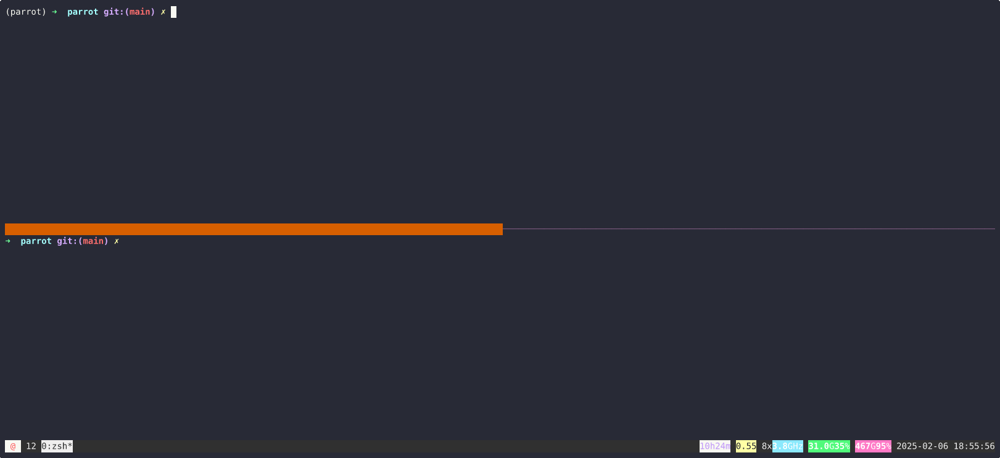

# Parrot 🦜

A server to echo back HTTP requests.



## Installation

```bash
pip install .
```

## Usage

### Local Development

Run the server locally:

```bash
parrot serve
```

### Configuration

The server can be configured using environment variables or command line options:

| Environment Variable | CLI Option    | Default | Description                    |
|---------------------|---------------|---------|--------------------------------|
| HOST                | --host        | ""      | Host to bind to               |
| PORT                | --port        | 8080    | Port to run the server on     |
| LOG_FORMAT          | --log-format  | pretty  | Log format (pretty or json)   |
| LOG_LEVEL           | INFO          | -       | Logging level                 |

CLI options take precedence over environment variables.

### Docker

Build the container:

```bash
docker build -t parrot .
```

Run the container:

```bash
docker run -p 8080:8080 parrot
```

### Kubernetes

Deploy using kubectl:

```bash
kubectl apply -f k8s/
```

Or using Helm:

```bash
helm install parrot ./k8s/helm
```

## Endpoints

- `GET /health` - Health check endpoint with uptime and request count
- `ANY /*` - Echo back request details

## Development

Install development dependencies:

```bash
pip install ".[dev]"
```

Run tests:

```bash
pytest
```

## License

MIT
